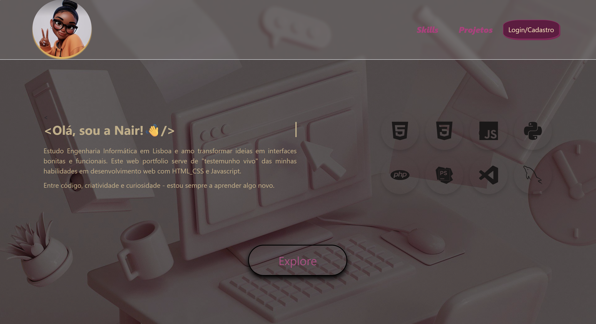
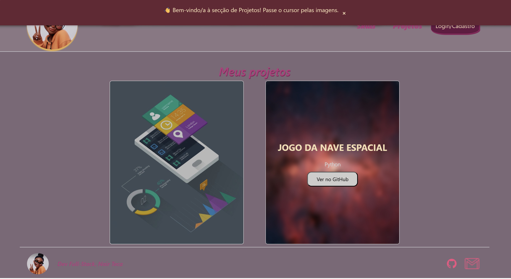

# 🌐 Portfólio Web

Este é o meu portfólio pessoal, desenvolvido com **HTML, CSS, JavaScript**, para apresentar os meus projetos, competências e experiência como desenvolvedora em formação.

---

## 🎯 Objetivo

O objetivo deste projeto é:  
- Mostrar competências em **desenvolvimento web** usando HTML, CSS e JavaScript.  
- Criar um **layout responsivo e moderno**, funcional em diferentes dispositivos.  
- Servir como **portfólio profissional** para recrutadores e colegas da área de Engenharia de Software.

---

## 💻 Tecnologias Utilizadas

- **HTML5** – Estrutura do site  
- **CSS3** – Estilização e responsividade  
- **JavaScript (Vanilla JS)** – Interatividade e animações  
- **Bootstrap 5** – Layout e componentes responsivos  
- **Devicon** – Ícones de linguagens e ferramentas  
- **Python, PHP, MySQL** – Tecnologias usadas em projetos apresentados  

---

## ✨ Funcionalidades

- **Seção Sobre Mim** com descrição pessoal e competências  
- **Seção de Skills** com ícones das linguagens e ferramentas usadas



- **Seção de Projetos** com cards interativos, links para demo e GitHub



- **Menu de navegação fixo** e responsivo  
- Pequenas animações e efeitos de interatividade com JavaScript  
- **Footer** com contacto e redes sociais  

---

## 📂 Projetos em Destaque

1. **Sistema de Gestão de Funcionários**  
   - Tecnologias: PHP, MySQL, HTML, CSS, JavaScript  
   - [Ver no GitHub](https://github.com/nair-teca/Sistema-de-Gest-o-de-Pessoas-em-PHP.git)

2. **Jogo da Nave Espacial**  
   - Tecnologias: Python  
   - [Ver no GitHub](https://github.com/nair-teca/Jogo_NaveEspacial_Python.git)

---

## 🚀 Como executar o projeto

1. Clona este repositório:  
   ```bash
   git clone https://github.com/nair-teca/meusite.git
